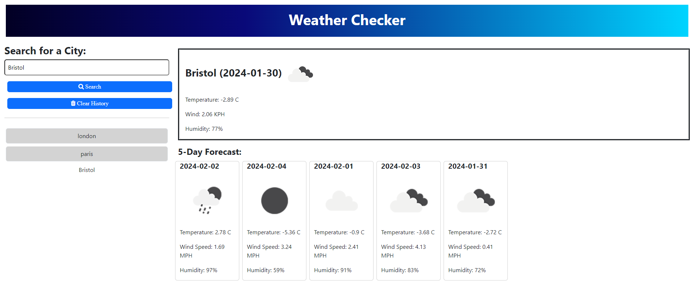

# Weather-Checker

## Description
A simple weather forecasting app to display the current weather and the forecast for the next 5 days for any city. Information includes wind speed, humidity and temperature with icons displaying how sunny/cloudy/rainy it is or will be.

## Usage

Use the search input to search the city you would like to see the weather for. Search history will be saved for quick access to previous searches and clear history if you no longer wish to see to see previous searches.

## Credits

TA Donnahue kindly helped when I was having issues with local storage.

## Resources

* bootstrap
* developer.mozilla
* stackoverflow
* freecodecampforum
* xpert learning assistant
